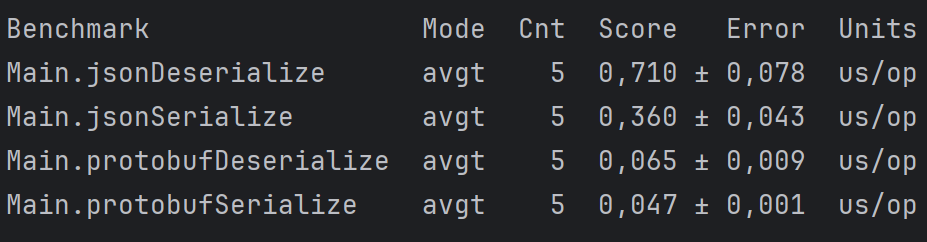

Я выводы буду делать только по одному Mode - AverageTime (явно указано в классе Main). \
По результатам прогона бенчмарков было получены следующие результаты. 
Благодаря им мы видимо, что процессы сериализации и десериализации на порядок
быстрее выполняются при работе с protobuf. \
Если говорить, когда и что выбирать, то:
* JSON хорошо использовать для приложений с веб-интеграцией, быстрой разработкой, где REST и местах, 
где важно отсматривать логирование и в целом есть необходимость читать, что передаем и что получаем в запросах.
  * Protobuf же стоит использовать в Highload системах, где критична скорость, пропускная способность. Помимо этого
если JSON используется в REST, то protobuf хорошо будет себя чувствовать в местах, где используется gRPC.